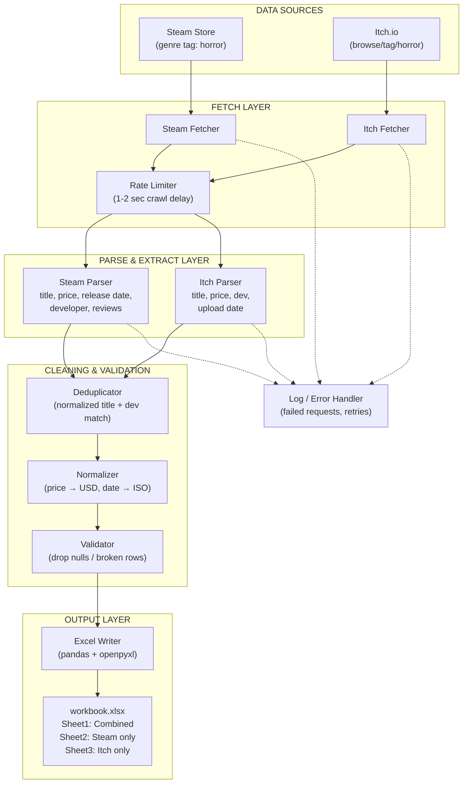

# 👻 Horror Game Data Scraper

A collaborative data scraping project that collects **horror-genre games**
from **Steam** and **Itch.io** and stores them in a structured Excel
spreadsheet for analysis.

## 🏗️ Architecture Overview

The pipeline is divided into five core components:

1. **Data Sources** — Steam Store and Itch.io (horror tag pages)
2. **Fetch Layer** — HTTP requests with rate limiting to stay polite
3. **Parse & Extract Layer** — pulls structured fields from raw HTML/JSON
4. **Cleaning & Validation** — dedupe, normalize, and drop broken rows
5. **Output Layer** — writes the cleaned data to an Excel workbook

## 🛠️ Tech Stack

| Component | Tooling |
|---|---|
| Fetching | `requests` |
| Parsing | `BeautifulSoup` / JSON |
| Cleaning | `pandas` |
| Excel output | `openpyxl` |

## 📋 Planned Spreadsheet Schema

| Column | Description |
|---|---|
| `title` | Game name |
| `platform` | `steam` or `itch` |
| `price_usd` | Normalized price |
| `release_date` | ISO format (YYYY-MM-DD) |
| `developer` | Developer / publisher |
| `reviews_positive` | Positive review count (Steam only) |

## ⚠️ Scraping Etiquette

- 1–2 second delay between requests (Itch.io throttles aggressively)
- Retry failed requests with exponential backoff
- Cache raw responses locally so re-runs don't re-hit servers

## 🚀 Getting Started

*(placeholder — add install/run instructions once the skeleton exists)*
